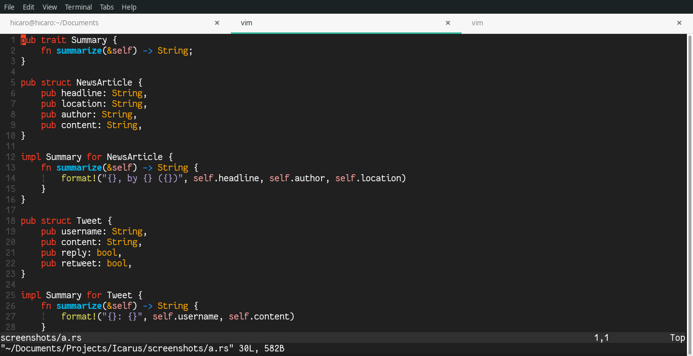

# Icarus


🎨 A simple dark based color scheme for [Neo]Vim. 

## Screenshots


See more screenshots [here](screenshots/)

## Installation

1. [Plug][]

    In your `.vimrc` or `init.vim` (For NeoVim):
    ```
    Plug 'HicaroD/Icarus'
    ```

2. [Vundle][]

    In your `.vimrc` or `init.vim` (For NeoVim):
    ```
    Plugin 'HicaroD/Icarus'
    ```

[vundle]: https://github.com/gmarik/Vundle.vim
[plug]: https://github.com/junegunn/vim-plug

## Usage

Add this to your `.vimrc`:

```
set termguicolors
colorscheme icarus
```

## Contributions

If you find any problems with this color scheme please post an issue here on
GitHub. 

## Credits

Thank vou very much for the amazing color recomendations, [Marcelo][], [Noemy][], [Rebeca][] and [Wemilly][]. The idea was to mix
my friends's favorite colors in one color scheme, that's was the result. I hope everyone like it :smile:.

[marcelo]: https://github.com/basedCadet
[noemy]: https://github.com/noemyroberta
[rebeca]: https://github.com/becacoli 
[wemilly]: https://github.com/wemillymaria

## License

Original license from pencil: [MIT](LICENSE)
